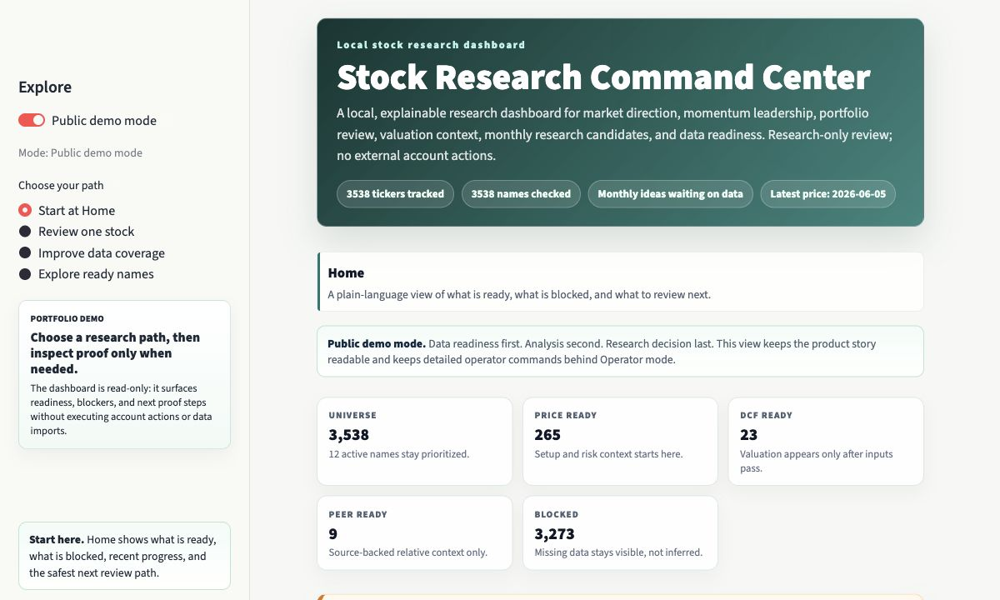
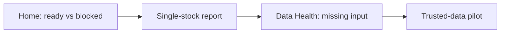

# Stock Research Command Center

A local, CSV-first research dashboard for screening stocks, reviewing portfolio names, and seeing exactly which data is ready to support analysis.

> Data readiness first, analysis second, research decision last.



## What It Does

This project turns a broad stock universe into a readiness-first research dashboard. It checks market data before analysis, separates `Research Now`, `Monitor`, and `Blocked by Data` review states, explains missing prices, fundamentals, DCF inputs, peers, earnings, and analyst estimates, and produces Streamlit pages plus single-stock reports with At A Glance status, a plain-English Reader Guide, an Evaluation Snapshot, a Proof Checklist, Best Review Path, data-confidence cues, source readiness notes, and copyable local proof commands.



## LinkedIn Visitor Snapshot

- Best first click: open the real dashboard preview, then skim the example reports for `NVDA`, `META`, `QQQ`, `MU`, and `CRDO`; the operator metrics screenshot is `docs/assets/operator-data-health-metrics-real.jpg`.
- Core product idea: missing data is a quality-control signal, not something to hide or guess.
- Strongest demo: ready data is analyzed, blocked data stays visible, and ETF/index methods are excluded instead of forced.
- Share-safe boundary: this is research software, not investment advice, broker integration, or an execution system.
## What You Can Analyze

When trusted local data is available, the product can produce:

- Price, momentum, benchmark-relative return, drawdown, volatility, beta, Sharpe/Sortino review metrics, liquidity, and market-direction context.
- Portfolio purpose checks and thesis-review flags.
- DCF readiness and conservative scenario valuation.
- Peer-context readiness without pretending missing peer valuation exists.
- ETF/index monitor reports where operating-company DCF is excluded.
- Single-stock reports with At A Glance status, a Reader Guide, an Evaluation Snapshot, a Proof Checklist, Best Review Path, data-confidence cues, methodology, risks, blockers, copyable local proof commands, and source readiness notes.

Most blocked rows are not errors. They are data gaps the command center exposes instead of hiding.

## How Analysis Works

The report is not a black box: local data rows provide inputs, and project rules decide what can be analyzed.

1. Readiness gate: checks prices, fundamentals, DCF fields, peers, earnings, and estimates before deeper analysis appears.
2. Supported analysis: price-ready rows can support setup/risk context and benchmark/risk review metrics, DCF-ready rows can support assumptions and sensitivity, and peer-ready rows can support source-backed relative context.
3. Locked or excluded boundaries: missing fundamentals, peer inputs, earnings, or estimates stay locked; company valuation is excluded for ETF/index/fund monitor rows, not failed.
4. Report explanation: single-stock reports show what came from source rows, what the product calculated, what stayed withheld, and the next local proof step.

## Current Snapshot

The local sample currently tracks a broad universe of 3,538 tickers, with a smaller subset ready for each analysis feature. Exact ready counts can change after local refresh/import work, so use `make status-check TOP_N=5` or the dashboard Home page for the current snapshot.

Read the counts in three layers:

| Layer | What it means | How to use it |
| --- | --- | --- |
| Master universe | The broad ticker list the project can track. | Good for coverage planning, not proof that every analysis is ready. |
| Active universe | The focused research list for demo and portfolio-style review. | Best place to inspect product flow and next trusted-data steps. |
| Analysis-ready subset | Tickers whose required local inputs passed readiness for a feature. | Use this layer for DCF, peer context, or candidate review; blocked rows stay visibly locked. |

Visitor status: the product workflow, dashboard, single-stock reports, readiness gates, demo path, and public checks are working. Broad fundamentals, DCF, peers, earnings, and analyst estimates remain visibly blocked by missing trusted data until trusted rows exist, so those gaps should be read as source-proof work rather than broken analysis.

## Data Coverage Strategy

The product separates refreshable data from judgment-required data:

| Data lane | Best next move | Why it matters |
| --- | --- | --- |
| Prices | Use `make price-refresh-loop DRY_RUN=1` before capped refreshes. | Price coverage can scale safely, but refreshed CSVs should be reviewed before commit. |
| Fundamentals / DCF | Use `make fundamentals-batch-proof TOP_N=10` for a reviewed SEC/manual proof packet, or inspect one company with `make trusted-data-pilot-packet TICKER=CRDO` before staging rows. | Company valuation only appears after required fields, validation, preview, rejected-row review, and readiness proof pass. |
| Peers | Use `make peer-batch-proof TOP_N=10` to separate source-backed peer mappings from mapped-peer valuation inputs; use the ranked pilot packet first when a peer-input lane leads, such as `make trusted-data-pilot-packet TICKER=MU`. | Peer trend and peer valuation stay separate; guessed peers or file row counts do not become valuation. |
| Earnings / estimates | Keep locked until trusted local rows exist. | Empty optional context is intentional, not a broken chart. |

For batch planning, start with `make readiness-ops-center` and `make coverage-frontier TOP_N=10`. Before any capped execution, `make reviewed-batch-preflight LANE=prices TOP_N=100` checks snapshot and freshness gates. When a lane is worth reviewing, `make reviewed-batch LANE=prices TOP_N=10` writes a copy-only packet with snapshot, dry-run, capped execution, validate/preview/apply gates, rollback notes, and proof fields. Fundamentals/DCF also has the direct operator shortcut `make fundamentals-batch-proof TOP_N=10`, which writes a SEC/manual proof packet without applying rows. After the reviewed scope is finished or intentionally skipped, `make reviewed-batch-compare LANE=prices BATCH_ID=<id> REVIEW_DATE=<date>` compares prior/current readiness snapshots for changed counts and tickers, then `DRY_RUN=1 make reviewed-batch-proof-record ... FINAL_OUTCOME=<supported|still_blocked|skipped|excluded>` previews the exact ledger row before `make reviewed-batch-proof-record ...` records the durable batch outcome in `data/reviewed_batch_proofs.csv`.

## What Works Today

This is a working local research prototype with deterministic outputs, dashboard smoke coverage, and regression tests. Strongest today: readiness gates, single-stock explanations, ETF/index monitor context, and DCF-ready company review. Main modes: `DCF-ready review`, `Standalone DCF review`, `Price/setup review only`, `Monitor-only context`, and `Data needed before analysis`.

Useful with limits: price/momentum, fundamentals/DCF, peer review, and final decision buckets when trusted local data exists. Intentionally locked: broad-universe fundamentals, peer comparison, earnings, and analyst estimates until trusted rows are imported. Not built to be: a full-market data vendor, real-time recommendation service, broker/execution system, or auto-refreshing trading system.

## Product Tour

Start with the three paths the dashboard is built around:

| Path | Use it when | First place to open |
| --- | --- | --- |
| Review one stock | You want a ticker-level research note with ready, blocked, excluded, and data-confidence states. | `Single-Stock Report` |
| Improve data coverage | You want to understand what trusted input is missing and how to add it safely. | `Data Health` |
| Explore ready names | You want to browse what the current local data can already support. | `Monthly Picks` |

The dashboard starts in public demo mode so visitors can read the product first. Use `http://localhost:8501/?mode=public` for the clean GitHub/LinkedIn path, and switch off Public demo mode in the sidebar when you want the internal operator views, detailed boards, and copy-only local commands. Focused pages cover Monthly Picks, Market Direction, Momentum Leaders, Portfolio Review, Value / Re-rating, Final Watchlist as readiness-state output, not an action list, Single-Stock Report, and Data Health.

## Quick Start

Run these from the repository root so `make` can find the project targets. This first path is visitor-safe: it does not rebuild broad generated outputs before you have seen the product.

```bash
pip install -e '.[dev]'
make demo
make status-check TOP_N=5
make stock-report-md TICKER=NVDA
make dashboard
```

When you want to rebuild local outputs after changing data, use the deeper [Local Workflow Guide](docs/OPERATOR_GUIDE.md) for rebuild, import, refresh, and proof steps.

## Try This Demo Path

```bash
make demo                       # prints the visitor demo path
make dashboard                  # open http://localhost:8501/?mode=public and follow the three public paths
make stock-report-md TICKER=NVDA # company report with DCF assumptions
make stock-report-md TICKER=META # price/setup report with valuation still gated
make stock-report-md TICKER=QQQ  # ETF/index report with DCF excluded
make stock-report-md TICKER=MU   # standalone DCF report with peer valuation still locked
make stock-report-md TICKER=CRDO # fundamentals/DCF proof packet example
make trusted-data-pilot-candidates TOP_N=10 # read-only coverage candidate list
make trusted-data-pilot-packet TICKER=MU   # first ranked peer-input proof packet
make trusted-data-pilot-packet TICKER=CRDO # fundamentals/DCF proof packet
make metric-readiness TOP_N=5 BENCHMARK=SPY # capped readiness-gated metric queue
```

Optional extra report states:

```bash
make stock-report-md TICKER=SMH  # sector ETF monitor report
make stock-report-md TICKER=APLD # price/setup report with fundamentals still locked
```

The shortest public walkthrough is: Home -> NVDA proof report -> META blocked example -> QQQ excluded example -> MU peer-limited example -> CRDO fundamentals-gated example -> trusted-data pilot. That shows the core idea quickly: the product can analyze ready data, explain blocked data, exclude methods that do not apply, show peer-limited DCF, and print the trusted-data proof path without pretending missing rows exist.

Example map:

| Example | What it demonstrates | What to check |
| --- | --- | --- |
| [NVDA](outputs/stock_reports/nvda.md) | Company DCF assumptions and source-backed peer context from trusted local inputs. | Reader Guide, assumptions, sensitivity, peer caveats, source readiness notes. |
| [A](outputs/stock_reports/a.md) / [MU](outputs/stock_reports/mu.md) | Standalone DCF review where peer-relative valuation is still locked. | Reader Guide, DCF assumptions, and mapped-peer valuation-input proof steps. |
| [META](outputs/stock_reports/meta.md) | Price/setup review where valuation remains gated until trusted fundamentals/DCF inputs are ready. | Reader Guide, supported setup analysis, valuation blockers, and caveats. |
| [QQQ](outputs/stock_reports/qqq.md) / [SMH](outputs/stock_reports/smh.md) | ETF/index or sector monitor context. | Reader Guide plus Operating-company DCF is excluded, not failed. |
| [APLD](outputs/stock_reports/apld.md) / [CRDO](outputs/stock_reports/crdo.md) | Price/setup review with valuation still locked, plus fundamentals-gated proof workflow. | Reader Guide, supported setup context, one-company pilot packet, and the next trusted fundamentals proof step. |

In the dashboard, start on `Home`, then open `Single-Stock Report` for one ticker or `Data Health` when the Home page says analysis is blocked. Markdown reports start with a visitor scan cue, then `At A Glance`, a `Reader Guide`, an `Evaluation Snapshot`, a `Proof Checklist`, and `Best Review Path` so readers know what can be analyzed now, what is still locked or excluded, what valuation is supported or blocked, what trusted input matters next, what evidence proves the current mode, what to read first, and which copy-only command or proof step comes next. They show `Copyable Proof Commands` only when local data gaps block analysis; use `make stock-report TICKER=NVDA` only when you also want optional local report data for inspection.

For a share-ready walkthrough, use [Public Demo Walkthrough](docs/PUBLIC_DEMO_WALKTHROUGH.md). The pilot candidate command may rank a peer-input example such as `MU` first and also name a fundamentals/DCF example such as `CRDO`; both remain read-only proof packets until source review and rebuilt readiness prove a lane changed. The broader read-only checklist is still available as `make trusted-data-pilot TOP_N=10` when you want the general pilot sequence before choosing tickers. For deeper local missing-data details, use the [Local Workflow Guide](docs/OPERATOR_GUIDE.md). For the coverage strategy behind prices, fundamentals, peers, earnings, and analyst estimates, read [Data Strategy](docs/DATA_STRATEGY.md).

## Local Data Hygiene

Small example reports are included for review. Large refreshed files such as `data/prices.csv`, readiness CSVs, and report CSVs are local working data by default. Review them before committing; do not publish broad refresh changes unless intentionally selected.

Before sharing or committing, run `make public-check`, then `make diff-hygiene`. For a large dirty tree, run `make diff-hygiene-files` and review the ignored local pathspec files under `outputs/staging/` before staging. After staging, run `make staged-hygiene-check` before committing. The public check includes `make public-wording-check`, which scans visitor-facing docs, dashboard/report copy, and sample reports for unsupported advice, execution language, internal development notes, and stale repo links. Use the safe staging suggestion for product files and reviewed Markdown reports, and leave large generated CSV/JSON changes out unless they are the specific artifact you intend to publish.

The tracked `data/holdings.csv` file is a zero-position sample for portfolio-review demos. Keep real holdings, account exports, and personal cost-basis details out of the public branch.

## License

This repository is shared as a public portfolio/demo project. Reuse terms are not specified yet: no open-source license has been selected, so visitors may review the code and product design, but reuse rights are not granted until a license is added. See [License Decision Guide](docs/LICENSE_DECISION_GUIDE.md) before describing the project as open source.

## Analysis Methodology

The stock-analysis method is implemented in this repository: readiness gates, momentum rules, DCF assumptions, relative-valuation checks, peer readiness, and report wording live under `src/`. Standard Python packages support data handling and UI; optional `yfinance` is an unofficial research-grade adapter. The analysis rules, valuation gates, decision buckets, and research-only guardrails come from project code plus local CSV inputs. Fundamentals-ready means trusted company fields can be reviewed, DCF-ready means scenario math can be reviewed, and peer-ready means source-backed relative context can be reviewed. See [Research Methodology](docs/METHODOLOGY.md) for the calculation flow and [Analysis Capability Audit](docs/analysis_capability_audit.md) for what is strong today, what remains limited, and where the method lives.

## Core Outputs

The main build creates deterministic research files under `outputs/`, including purpose classification, market direction, momentum leaders, portfolio review, valuation-readiness context, final watchlist, and research decisions. `undervalued_candidates.csv` is a legacy filename for valuation-readiness and re-rating context, not automatic undervalued calls. Readiness and source-health reports live under `data/reports/`.

## Research-Only Guardrails

This is investment research software, not investment advice and not a trading system. It does not place orders, connect to brokers, route trades, auto-trade, recommend option trades, provide direct buy/sell instructions, or fabricate prices, fundamentals, peers, earnings, analyst estimates, valuation inputs, or recommendations.

That constraint is intentional. The product is useful because it says when data is missing instead of pretending every ticker is ready.

## Architecture

The app is organized around dashboard, readiness, decision, report, provider, local-data, and test modules. It is CSV-first and deterministic by default. Optional network-backed data stays behind provider interfaces and is labeled as research-grade when used.

## Roadmap Snapshot

The next product stage is not more indicators. It is a clearer research operations path: Data Health starts with a lane cockpit, readiness comparison proof, peer sub-state drilldown, reviewed-batch planning, reviewed-batch proof history, and readiness-gated review metric routing, while fundamentals/DCF, source-backed peers, and optional earnings/estimate context stay locked until trusted rows prove readiness.
