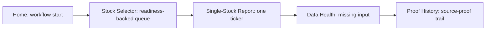

# Stock Research Command Center
A local, CSV-first research dashboard for screening stocks, reviewing portfolio names, and seeing exactly which data is ready to support analysis.
> Data readiness first, analysis second, research decision last.

## External Reviewer Start Here
This repository is ready to review as a controlled GitHub/LinkedIn portfolio demo. It is not currently published as a hosted Streamlit app.

| Question | Short answer |
| --- | --- |
| What should I open first? | Start with this README preview, then use `docs/PUBLIC_DEMO_WALKTHROUGH.md` for the five-page workflow. |
| What is the live app path? | Run `make demo-dashboard`, then open `http://localhost:8501/?mode=public`. |
| What workflow should I follow? | Home -> Stock Selector -> Single-Stock Report -> Data Health -> Proof History. |
| What should I run when I ask what is next? | Run `make next-stage` for the current package answer, hosted-demo state, provider-key state, source-proof queue status, and decision ladder; it is read-only and does not refresh data, import rows, stage files, commit, push, deploy, or expose secrets. |
| What is the current roadmap? | Read `docs/NEXT_STAGE_ROADMAP.md` for the priority order, blocked dependencies, and commands to avoid repeating exhausted proof loops. |
| How should I collect pilot feedback? | Run `make pilot-review-feedback`, then use `docs/PILOT_REVIEW_FEEDBACK_TEMPLATE.md` and `docs/PILOT_REVIEW_FEEDBACK_LOG_TEMPLATE.csv` for anonymous workflow-clarity notes only; use `make pilot-feedback-closeout` before turning notes into fixes or deferrals. |
| Which screenshot should I use? | Use `docs/assets/linkedin-public-dashboard.png` for LinkedIn Featured or GitHub preview context. |
| What proves current local readiness? | `make status-check TOP_N=5` remains the source for current local counts; screenshots are product evidence only. |
| What should I not claim? | No hosted app yet, no open-source reuse, no investment advice, no broker integration, no auto-trading, and no screenshot-based data freshness proof. |

First review move: open Stock Selector, choose a ticker such as `NVDA`, read the Single-Stock Report answer, then open Data Health only when an input is blocked. The tracked [Data Profiles](docs/DATA_PROFILES.md) guide separates this compact public snapshot from the ignored local research workspace.
## What It Does
This project turns a broad stock universe into a readiness-first research dashboard. It checks market data before analysis, separates `Research Now`, `Monitor`, and `Blocked by Data` review states, explains missing prices, fundamentals, DCF inputs, peers, earnings, and analyst estimates, and produces Streamlit pages plus single-stock reports with At A Glance status, a plain-English Reader Guide, an Evaluation Snapshot, a Proof Checklist, Best Review Path, data-confidence cues, source readiness notes, and read-only proof steps.

```mermaid
flowchart LR
    Home["Home: workflow start"] --> Selector["Stock Selector: readiness-backed queue"]
    Selector --> Report["Single-Stock Report: one ticker"]
    Report --> Health["Data Health: missing input"]
    Health --> Proof["Proof History: source-proof trail"]
```
## Now / Next / Not Yet
This is the fastest reviewer answer: the product is shareable as a controlled demo now, deeper coverage is source-gated, and hosting/provider automation stays optional until verified.
| Stage | Answer | Guardrail |
| --- | --- | --- |
| Now | GitHub/LinkedIn portfolio demo with public workflow, screenshots, methodology, local run commands, and manual gates. | Use `make public-check` before sharing; keep generated churn excluded. |
| Next | Optional hosted Streamlit deployment or first keyed-provider smoke, starting with FMP if a key is configured outside the repo. | Use `make hosted-demo-readiness` or `make provider-setup-checklist`; one ticker only before validate/preview. |
| Not yet | Full hosted data product, complete fundamentals/peer/optional coverage, or provider-backed automation across the universe. | Do not claim this until external hosting, provider keys, source proof, validation, preview, apply, rebuilt readiness, and proof history support it. |
## Current Next Stages
Use this table to decide what to do next without reopening exhausted proof loops or overstating the public demo.
| Stage | Current state | Next safe move |
| --- | --- | --- |
| LinkedIn publish | Ready after GitHub sync | If the branch is ahead, push reviewed commits after `make public-check`; if GitHub is synced, use the GitHub link and `docs/LINKEDIN_PROJECT_BRIEF.md`; do not claim hosted app availability. |
| Hosted Streamlit demo | External account required | Run `make hosted-demo-readiness`, then follow `docs/HOSTED_DEMO_DEPLOYMENT.md`; keep GitHub as the public link until the hosted route is verified. |
| FMP provider activation | External key required | Configure `FMP_API_KEY` outside the repo, then run one reviewed ticker smoke before any broader batch. |
| Peer readiness upgrade | Source-gated | Keep candidate peers as context only until source-backed peer rows pass review. |
| Optional earnings / estimates | Locked | Use trusted provider or reviewed manual rows only; do not infer optional context. |
| Broad proof queues | Do not retry now | Current queues are exhausted; reopen only after keyed provider rows, reviewed manual rows, or changed blockers exist. |
| Public UX polish | Share-review ready | Live desktop/mobile route notes are resolved; rerun `make public-ux-review-notes-check` after any UI wording, layout, or route change. |
| Generated artifacts | Excluded by default | Keep local CSV/report/sample-report churn unstaged unless one exact artifact is reviewed as public evidence. |
## What You Can Analyze
When trusted local data is available, the product can produce price, momentum, benchmark-relative return, drawdown, volatility, beta, Sharpe/Sortino review metrics, liquidity, market-direction context, portfolio purpose checks, thesis-review flags, DCF readiness, conservative scenario valuation, source-backed peer context, ETF/index monitor reports, and single-stock reports with reader guidance, proof checklists, blockers, read-only proof steps, and source readiness notes. Most blocked rows are not errors. They are data gaps the command center exposes instead of hiding.
## How Analysis Works
The report is not a black box: local data rows provide inputs, and project rules decide what can be analyzed. Price-ready rows can support setup/risk context and benchmark/risk review metrics, DCF-ready rows can support assumptions and sensitivity, and peer-ready rows can support source-backed relative context. Missing fundamentals, peer inputs, earnings, or estimates stay locked; company valuation is excluded for ETF/index/fund monitor rows, not failed.
## Current Snapshot
The local sample tracks a broad stock universe, with a smaller subset ready for each analysis feature. Exact universe and ready counts can change after local refresh/import work, so use `make status-check TOP_N=5` or the dashboard Home page for the current snapshot.
Read the counts in three layers: master universe for broad coverage planning, active universe for the demo/research workflow, and analysis-ready subsets for DCF, peer context, or candidate review. A tracked ticker is not automatically ready for every analysis family; blocked rows stay visibly locked.
Visitor status: the product workflow, dashboard, single-stock reports, readiness gates, visitor path, and public checks are working. Broad fundamentals, DCF, peers, earnings, and analyst estimates remain visibly blocked by missing trusted data until trusted rows exist, so those gaps should be read as source-proof work rather than broken analysis.
## External Reviewer Handoff
Use this as the short GitHub/LinkedIn review path before reading operator detail:
| Question | Short answer |
| --- | --- |
| Review first | Dashboard preview, then Home -> Stock Selector -> Single-Stock Report -> Data Health -> Proof History. |
| Use as evidence | Public pages, committed real screenshots, sample Markdown reports, methodology docs, and `make public-check` output. |
| Responsive proof | Desktop and phone-width workflow evidence is recorded in `docs/DASHBOARD_QA.md`; screenshots are still product evidence only. |
| Skip unless operating locally | Broad CSV/report churn, provider setup, validate/preview/apply commands, and raw proof ledgers. |
| Do not claim | Screenshots prove data freshness, blocked inputs are ready, the repo is open source, or the product gives buy/sell instructions. |
| Best next question | Can a reviewer understand what is ready, blocked, excluded, and proof-backed before opening advanced details? |
## Data Coverage Strategy
| Data lane | Best next move | Why it matters |
| --- | --- | --- |
| Prices | Use `make price-history-proof-queue TOP_N=25` before `make price-refresh-loop DRY_RUN=1`; `PROVIDER=auto` tries Stooq, Yahoo, optional IBKR read-only if explicitly configured, then configured FMP/Alpha Vantage/Finnhub price fallbacks. | Price coverage can scale safely, but refreshed CSVs should be reviewed before commit. |
| Fundamentals / DCF | Use `make dcf-input-proof-queue TOP_N=25` to see whether DCF is blocked by shares outstanding, revenue, free cash flow, FCF margin, price, or an input bundle; then use `make dcf-input-source-command-plan FAMILY=shares_outstanding TOP_N=10` to group source review, guard, validate, preview, apply boundary, rebuild proof, and handoff commands before `DRY_RUN=1 make fundamentals-batch-proof TOP_N=10`. | Company valuation only appears after required source fields, validation, preview, rejected-row review, apply decision, and readiness proof pass. |
| Shares outstanding proof | Use `make share-count-proof-queue TOP_N=10` when DCF is blocked specifically by `shares_outstanding`. | Share count must come from SEC/manual source proof or trusted local rows; the product does not infer it from price, market cap, or peers. |
| Peers | Use `DRY_RUN=1 make peer-batch-proof TOP_N=10` to preview source-backed peer mappings separately from mapped-peer valuation inputs; use `DRY_RUN=1 make peer-mapping-source-review TOP_N=10` before editing `data/imports/peers.csv`; use `docs/TRUSTED_PEER_PILOT_SOURCE_TEMPLATE.csv` to collect reviewed 25-50 company source rows outside the import file; use `make peer-mapping-writeback-guard ...` to block placeholders, self-peers, and duplicate peer pairs before copy/paste, then dry-run the proof-record scaffold; use the ranked pilot packet first when a peer-input lane leads, such as `make trusted-data-pilot-packet TICKER=MU`. | Peer trend and peer valuation stay separate; guessed peers or file row counts do not become valuation, and candidate context stays out of trusted proof. |
| Earnings / estimates | Keep locked until trusted local rows exist. | Empty optional context is intentional, not a broken chart. |
Pilot packaging is read-only first: `make pilot-readiness-check TOP_N=10` checks sync, hygiene, freshness, source-proof queues, proof ledger, screenshot evidence, public-check, and guardrails; `make pilot-share-brief` writes the concise public/demo share brief at `outputs/pilot_share_brief.md`, which does not refresh data or unlock blocked inputs; `make pilot-readiness-packet` writes the fuller reviewer packet; and `make diff-hygiene-summary` keeps broad generated patterns excluded unless a specific artifact is reviewed evidence.
When proof queues are exhausted, use `make project-status-check` and then `make provider-setup-checklist`. Provider setup is only an activation boundary: it can activate a source, but readiness changes still require validate, preview, rejected-row review, source provenance, apply/skip decision, rebuilt readiness, and proof ledger evidence. No broad coverage batch should run from setup alone. Do not retry exhausted proof queues until new source-backed rows, keyed provider data, reviewed manual rows, or changed blockers exist.

Before turning any refresh path into a recurring job, run `make scheduler-activation-checklist`. Scheduler maturity starts as status-only monitoring; mutating refresh or apply paths stay off until provider smoke or source proof, validation, preview, zero rejected rows, provenance, no-fabrication checks, rebuilt readiness, proof history, and proof recording pass.
For batch planning after the pilot gate, use `make readiness-ops-center`, `make readiness-queue TOP_N=10`, `make data-coverage-proof-queues TOP_N=10`, `make coverage-frontier TOP_N=10`, and `make data-coverage-planner TOP_N=10`. The readiness queue summarizes fundamentals/DCF, peer mapping, mapped-peer valuation inputs, optional locked lanes, and SPY/QQQ metric-readiness blockers before opening ticker-level proof. The data-coverage proof queue portfolio then puts the DCF input batches, shares-outstanding proof, trusted fundamentals proof, peer mapping proof, and peer valuation-input proof queues side by side with next commands, stop rules, and generated-churn policy.
For reviewed execution planning, use `make coverage-expansion-loop TOP_N=10`, then `make reviewed-batch-preflight LANE=prices TOP_N=100` before any capped execution. When a DCF input family is selected, `make dcf-input-proof-handoff FAMILY=shares_outstanding TOP_N=10` groups the packet, validate, preview, apply boundary, readiness proof, comparison, and proof-record dry run without touching local CSV rows. For another reviewed lane, `DRY_RUN=1 make reviewed-batch LANE=prices TOP_N=10` previews the batch packet; remove `DRY_RUN=1` only when the packet artifact itself is intentionally reviewed evidence. Fundamentals/DCF also has the direct operator shortcut `DRY_RUN=1 make fundamentals-batch-proof TOP_N=10`, while share-count-only DCF blockers can use `DRY_RUN=1 make reviewed-batch LANE=share_count TOP_N=10`; both preview proof packets without applying rows.
After a reviewed scope is finished or intentionally skipped, `make reviewed-batch-compare LANE=prices BATCH_ID=<id> REVIEW_DATE=<date>` compares prior/current readiness snapshots, then `DRY_RUN=1 make reviewed-batch-proof-record ... FINAL_OUTCOME=<supported|candidate_context_only|still_blocked|skipped|excluded>` previews the exact ledger row before recording the durable batch outcome in `data/reviewed_batch_proofs.csv`. Use `candidate_context_only` when generated or classification-based peer context can route review work but must not be promoted to trusted peer proof.

## What Works Today
This is a working local research prototype with deterministic outputs, dashboard smoke coverage, and regression tests. Strongest today: readiness gates, single-stock explanations, ETF/index monitor context, and DCF-ready company review. Main modes: `DCF-ready review`, `Standalone DCF review`, `Price/setup review only`, `Monitor-only context`, and `Data needed before analysis`.
Useful with limits: price/momentum, fundamentals/DCF, peer review, and final decision buckets when trusted local data exists. Intentionally locked: broad-universe fundamentals, peer comparison, earnings, and analyst estimates until trusted rows are imported. Not built to be: a full-market data vendor, real-time recommendation service, broker/execution system, or auto-refreshing trading system.

## Product Tour
Start with the five public paths the dashboard is built around:
| Path | Use it when | First place to open |
| --- | --- | --- |
| Home | You want the workflow question, next safe action, stop rule, and then readiness context before choosing a route. | `Home` |
| Stock Selector | You want to filter readiness-backed candidates before opening a one-ticker report. | `Stock Selector` |
| Single-Stock Report | You want a ticker-level research note with ready, blocked, excluded, and data-confidence states. | `Single-Stock Report` |
| Data Health | You want to understand what trusted input is missing and which proof path should be reviewed next. | `Data Health` |
| Proof History | You want one evidence answer before opening raw proof ledger details. | `Proof History` |
The dashboard starts in public visitor mode at `http://localhost:8501/?mode=public`.
- Home answers what the product is, where to start, and when to stop.
- Stock Selector filters readiness-backed candidates without framing the queue as advice.
- Single-Stock Report shows selected-ticker readiness, usable sections, blocked inputs, and one next step before detailed report sections.
- Data Health starts with Coverage Summary / What Can I Use, one answer per lane, and advanced proof drawers collapsed.
- Proof History is evidence-only before trusting a changed readiness state.

Switch off Public visitor mode only for internal Operator context, detailed boards, local proof commands, and validate / preview / apply guidance. Advanced pages remain secondary, and watchlist-style outputs stay readiness-state output, not an action list.

## Quick Start
Run these from the repository root so `make` can find the project targets. Open the product before proof packets or report commands so reviewers see the guided workflow before operator detail.

```bash
pip install -e '.[dev]'
make demo       # print the safe visitor path without changing local data
make demo-dashboard  # open the compact tracked profile at http://localhost:8501/?mode=public
```

Optional read-only proof after the app flow is clear: `make status-check TOP_N=5`, `make pilot-readiness-check TOP_N=10 && make pilot-readiness-packet`, and `make stock-report-md TICKER=NVDA`.

For the mutable default operator workspace, use `make dashboard`; it is intentionally separate from the public demo profile and can reflect local refresh/import work.

When you want to run a controlled pilot, use the [Pilot Runbook](docs/PILOT_RUNBOOK.md). When you want to rebuild local outputs after changing data, use the deeper [Local Workflow Guide](docs/OPERATOR_GUIDE.md) for rebuild, import, refresh, and proof steps.

For 5-10 external reviewer sessions, run `make pilot-review-feedback` and use [Controlled Pilot Review Feedback](docs/PILOT_REVIEW_FEEDBACK_TEMPLATE.md) plus the structured [feedback log template](docs/PILOT_REVIEW_FEEDBACK_LOG_TEMPLATE.csv). Then run `make pilot-feedback-closeout` and follow the [Pilot Feedback Closeout Checklist](docs/PILOT_FEEDBACK_CLOSEOUT_CHECKLIST.md) to classify each row as `clear`, `reproducible_ui_issue`, `documentation_gap`, `environment_limited`, or `intentionally_deferred`. Capture route clarity and reproducible UX issues only; keep the working log outside Git until it is anonymized and intentionally reviewed; feedback does not prove data freshness, source readiness, investment conclusions, or coverage completion.

## Try This Visitor Workflow
Open the product first and follow the five-page path. Use terminal commands only when you want to inspect the same proof artifacts locally.

```bash
make demo                         # print the visitor path without changing local data
make demo-dashboard               # open the compact tracked demo profile
make stock-report-md TICKER=NVDA  # ready company report with DCF assumptions
make stock-report-md TICKER=ACIC  # price context with DCF still gated
make stock-report-md TICKER=QQQ   # ETF/index report with DCF excluded
make stock-report-md TICKER=MU    # DCF-ready company with peer context
make stock-report-md TICKER=AACI  # fundamentals-blocked company example
```

Optional local proof checks: `make project-status-check && make provider-setup-checklist && make universe-scope TICKERS=NVDA,ACIC TOP_N=10 && make risk-context`; use `make trusted-data-pilot-candidates TOP_N=10` only when status shows executable company candidates, then inspect `make trusted-data-pilot-packet TICKER=MU` or `make trusted-data-pilot-packet TICKER=AACI`.

The shortest public walkthrough uses NVDA, ACIC, AACI, QQQ, and MU only as optional state examples. That shows the core idea quickly: filter by readiness, analyze ready data, explain blocked data, exclude methods that do not apply, and show the trusted-data proof path without pretending missing rows exist.

Example map: [NVDA](outputs/stock_reports/nvda.md) and `MU` show DCF-ready company review with source-backed peer context; `ACIC` shows price context with the DCF path still gated; `AACI` shows a fundamentals-blocked company; [QQQ](outputs/stock_reports/qqq.md) and [SMH](outputs/stock_reports/smh.md) show ETF/index context where operating-company DCF is excluded, not failed. Generate the current local examples with `make stock-report-md TICKER=ACIC`, `make stock-report-md TICKER=AACI`, and `make stock-report-md TICKER=SMH`.

In the dashboard, start on `Home`, open `Stock Selector` to narrow the next readiness-backed candidate, then open `Single-Stock Report` for one ticker or `Data Health` when the selected row says analysis is blocked. Check `Proof History` before trusting a changed readiness state. Markdown reports start with a visitor scan cue, then `At A Glance`, a `Reader Guide`, an `Evaluation Snapshot`, a `Proof Checklist`, and `Best Review Path` so readers know what can be analyzed now, what is still locked or excluded, what valuation is supported or blocked, what trusted input matters next, what evidence proves the current mode, what to read first, and which read-only proof step comes next. They show `Copyable Proof Commands` only when local data gaps block analysis; use `make stock-report TICKER=NVDA` only when you also want optional local report data for inspection.

For a share-ready walkthrough, use the [Visitor Workflow Walkthrough](docs/PUBLIC_DEMO_WALKTHROUGH.md). The pilot candidate command may rank a peer-input example such as `MU` first and also name a fundamentals/DCF example such as `CRDO`; both remain read-only proof packets until source review and rebuilt readiness prove a lane changed. The broader read-only checklist is still available as `make trusted-data-pilot TOP_N=10` when you want the general pilot sequence before choosing tickers. For deeper local missing-data details, use the [Local Workflow Guide](docs/OPERATOR_GUIDE.md). For the coverage strategy behind prices, fundamentals, peers, earnings, and analyst estimates, read [Data Strategy](docs/DATA_STRATEGY.md).

## Pilot Share Status
Share as controlled portfolio/demo evidence under the root `LICENSE`; do not describe the repository as open source or reusable software. Generated CSV/JSON/report churn stays local unless an exact artifact is reviewed as evidence. When source-proof queues are exhausted, use `make project-status-check` -> `make provider-setup-checklist` -> a reviewed one-ticker smoke command. Use `make project-status` only when you intentionally want to refresh the dashboard-ready status snapshot. No broad coverage batch should run from setup alone.

Hosting status: no public Streamlit URL is configured in this repository. The share-ready path is GitHub plus the tracked `make demo-dashboard` workflow. Add a hosted link only after a separate deployment account is configured, secrets are stored outside the repo, `make public-check` still passes, and the [Hosted Demo Deployment](docs/HOSTED_DEMO_DEPLOYMENT.md) checklist is satisfied.

## Local Data Hygiene
Small example reports are included for review. Large refreshed files such as `data/prices.csv`, readiness CSVs, and report CSVs are local working data by default. Review them before committing; do not publish broad refresh changes unless intentionally selected.

Before sharing or committing, run `make public-check`, then `make public-release-package` for the compact branch status, package status, staging, generated-exclusion, final-check, commit, and push checklist. Use `make public-release-handoff` when you want the exact terminal sequence for verify, pilot gate, stage, staged-file inspection, commit, branch-status check, and push. Use `make browser-qa-evidence` to see the current public-share screenshot recommendation, current real-app capture status, and the compact closeout table with route, first-view markers, save path, verify command, and reviewed-asset staging command; use `make public-ux-review-checklist` before a normal-browser desktop/mobile visual pass; use `make project-status-check` for a no-write project status read during review; use `make project-status` only when the dashboard-ready status snapshot should be refreshed; use `make linkedin-share-check` for the final LinkedIn Featured-card checklist; use `make browser-qa-capture-plan` only when replacing GitHub or LinkedIn screenshots with new real app captures. Use `make diff-hygiene` when you need the full file list. For a large dirty tree, run `make diff-hygiene-files` and review the ignored local pathspec files under `outputs/staging/`; the generated README there also shows whether the package is product-pending, generated-churn-only, or clean before staging. After staging, run `make staged-hygiene-check`, `git diff --cached --check`, and `git diff --cached --name-only` before committing. The public check includes `make public-wording-check`, which scans visitor-facing docs, dashboard/report copy, and sample reports for unsupported advice, execution language, internal development notes, and stale repo links. Use the safe staging suggestion for product files and reviewed Markdown reports, and leave large generated CSV/JSON changes out unless they are the specific artifact you intend to publish.

The tracked `data/holdings.csv` file is a zero-position sample for portfolio-review demos. Keep real holdings, account exports, and personal cost-basis details out of the public branch.

## License
This repository is shared under a controlled portfolio-demo license. Visitors may review the code, screenshots, docs, and product design for evaluation, but copying, redistribution, sublicensing, hosted reuse, and modified-publication rights are not granted without written permission. This is not an open-source release. Run `make license-status` for the current read-only reuse gate, and see [License Decision Guide](docs/LICENSE_DECISION_GUIDE.md) before changing reuse terms.

## Analysis Methodology
The stock-analysis method is implemented in this repository: readiness gates, momentum rules, DCF assumptions, relative-valuation checks, peer readiness, and report wording live under `src/`. Standard Python packages support data handling and UI; optional `yfinance` is an unofficial research-grade adapter, and configured FMP/Alpha Vantage/Finnhub keys can serve as research-grade fallback sources for price and fundamentals staging. The analysis rules, valuation gates, decision buckets, and research-only guardrails come from project code plus local CSV inputs. Fundamentals-ready means trusted company fields can be reviewed, DCF-ready means scenario math can be reviewed, and peer-ready means source-backed relative context can be reviewed. See [Research Methodology](docs/METHODOLOGY.md) for the calculation flow and [Analysis Capability Audit](docs/analysis_capability_audit.md) for what is strong today, what remains limited, and where the method lives.

## Core Outputs
The main build creates deterministic research files under `outputs/`, including purpose classification, market direction, momentum leaders, portfolio review, valuation-readiness context, final watchlist, and research decisions. `undervalued_candidates.csv` is a legacy filename for valuation-readiness and re-rating context, not automatic undervalued calls. Readiness and source-health reports live under `data/reports/`.

## Research-Only Guardrails
This is investment research software, not investment advice and not a trading system. It does not place orders, connect to brokers, route trades, auto-trade, recommend option trades, provide direct buy/sell instructions, or fabricate prices, fundamentals, peers, earnings, analyst estimates, valuation inputs, or recommendations.
That constraint is intentional. The product is useful because it says when data is missing instead of pretending every ticker is ready.

## Architecture
The app is organized around dashboard, readiness, decision, report, provider, local-data, and test modules. It is CSV-first and deterministic by default. Optional network-backed data stays behind provider interfaces and is labeled as research-grade when used.

## Roadmap Snapshot
The current public workflow is intentionally guided: Home -> Stock Selector -> Single-Stock Report -> Data Health -> Proof History. The next product stage is not another broad refresh loop: keep the GitHub/LinkedIn preview current, rerun live desktop/mobile review only after UI changes, choose a hosted app account only when you want a public URL, and activate trusted provider/source rows only through validation, preview, rejected-row review, rebuilt readiness, and proof history. Fundamentals/DCF, source-backed peers, and optional earnings/estimate context stay locked until trusted rows prove readiness.
