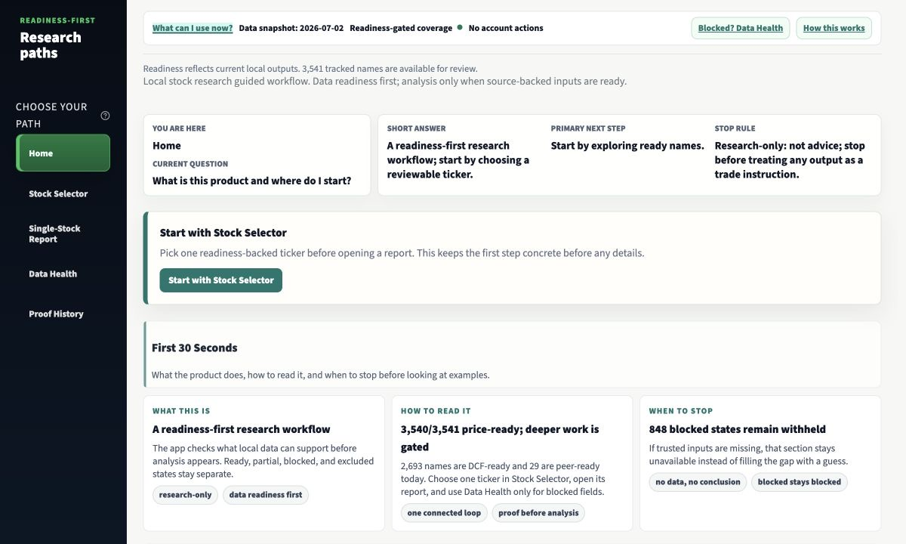
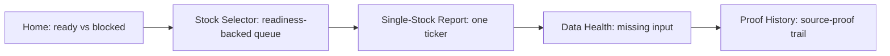

# Stock Research Command Center

A local, CSV-first research dashboard for screening stocks, reviewing portfolio names, and seeing exactly which data is ready to support analysis.

> Data readiness first, analysis second, research decision last.


## What It Does

This project turns a broad stock universe into a readiness-first research dashboard. It checks market data before analysis, separates `Research Now`, `Monitor`, and `Blocked by Data` review states, explains missing prices, fundamentals, DCF inputs, peers, earnings, and analyst estimates, and produces Streamlit pages plus single-stock reports with At A Glance status, a plain-English Reader Guide, an Evaluation Snapshot, a Proof Checklist, Best Review Path, data-confidence cues, source readiness notes, and copyable local proof commands.


```mermaid
flowchart LR
    Home["Home: ready vs blocked"] --> Selector["Stock Selector: readiness-backed queue"]
    Selector --> Report["Single-Stock Report: one ticker"]
    Report --> Health["Data Health: missing input"]
    Health --> Proof["Proof History: source-proof trail"]
```

## LinkedIn Visitor Snapshot

- Best first click: open the real dashboard preview, then skim the example reports for `NVDA`, `META`, `QQQ`, `MU`, and `CRDO`; the LinkedIn Featured thumbnail is `docs/assets/linkedin-public-dashboard.png`, while `make status-check TOP_N=5` remains the source for current local counts and `make browser-qa-evidence` checks public screenshot assets before replacement.
- Core product idea: missing data is a quality-control signal, not something to hide or guess.
- Strongest demo: ready data is analyzed, blocked data stays visible, and ETF/index methods are excluded instead of forced.
- Share-safe boundary: this is research software, not investment advice, broker integration, or an execution system.
## What You Can Analyze

When trusted local data is available, the product can produce price, momentum, benchmark-relative return, drawdown, volatility, beta, Sharpe/Sortino review metrics, liquidity, market-direction context, portfolio purpose checks, thesis-review flags, DCF readiness, conservative scenario valuation, source-backed peer context, ETF/index monitor reports, and single-stock reports with reader guidance, proof checklists, blockers, copyable local proof commands, and source readiness notes. Most blocked rows are not errors. They are data gaps the command center exposes instead of hiding.

## How Analysis Works

The report is not a black box: local data rows provide inputs, and project rules decide what can be analyzed.

1. Readiness gate: checks prices, fundamentals, DCF fields, peers, earnings, and estimates before deeper analysis appears.
2. Supported analysis: price-ready rows can support setup/risk context and benchmark/risk review metrics, DCF-ready rows can support assumptions and sensitivity, and peer-ready rows can support source-backed relative context.
3. Locked or excluded boundaries: missing fundamentals, peer inputs, earnings, or estimates stay locked; company valuation is excluded for ETF/index/fund monitor rows, not failed.
4. Report explanation: single-stock reports show what came from source rows, what the product calculated, what stayed withheld, and the next local proof step.

## Current Snapshot

The local sample currently tracks a broad universe of 3,538 tickers, with a smaller subset ready for each analysis feature. Exact ready counts can change after local refresh/import work, so use `make status-check TOP_N=5` or the dashboard Home page for the current snapshot.

Read the counts in three layers: master universe for broad coverage planning, active universe for the demo/research workflow, and analysis-ready subsets for DCF, peer context, or candidate review. A tracked ticker is not automatically ready for every analysis family; blocked rows stay visibly locked.

Visitor status: the product workflow, dashboard, single-stock reports, readiness gates, visitor path, and public checks are working. Broad fundamentals, DCF, peers, earnings, and analyst estimates remain visibly blocked by missing trusted data until trusted rows exist, so those gaps should be read as source-proof work rather than broken analysis.

## Data Coverage Strategy

The product separates refreshable data from judgment-required data:

| Data lane | Best next move | Why it matters |
| --- | --- | --- |
| Prices | Use `make price-refresh-loop DRY_RUN=1` before capped refreshes; `PROVIDER=auto` tries Yahoo, Stooq, then configured FMP/Alpha Vantage/Finnhub price fallbacks. | Price coverage can scale safely, but refreshed CSVs should be reviewed before commit. |
| Fundamentals / DCF | Use `make dcf-input-proof-queue TOP_N=25` to see whether DCF is blocked by shares outstanding, revenue, free cash flow, FCF margin, price, or an input bundle; then use `make dcf-input-source-command-plan FAMILY=shares_outstanding TOP_N=10` to group source review, guard, validate, preview, apply boundary, rebuild proof, and handoff commands before `DRY_RUN=1 make fundamentals-batch-proof TOP_N=10`. | Company valuation only appears after required source fields, validation, preview, rejected-row review, apply decision, and readiness proof pass. |
| Shares outstanding proof | Use `make share-count-proof-queue TOP_N=10` when DCF is blocked specifically by `shares_outstanding`. | Share count must come from SEC/manual source proof or trusted local rows; the product does not infer it from price, market cap, or peers. |
| Peers | Use `DRY_RUN=1 make peer-batch-proof TOP_N=10` to preview source-backed peer mappings separately from mapped-peer valuation inputs; use `DRY_RUN=1 make peer-mapping-source-review TOP_N=10` before editing `data/imports/peers.csv`; use `make peer-mapping-writeback-guard ...` to block placeholders, self-peers, and duplicate peer pairs before copy/paste, then dry-run the proof-record scaffold; use the ranked pilot packet first when a peer-input lane leads, such as `make trusted-data-pilot-packet TICKER=MU`. | Peer trend and peer valuation stay separate; guessed peers or file row counts do not become valuation. |
| Earnings / estimates | Keep locked until trusted local rows exist. | Empty optional context is intentional, not a broken chart. |

Pilot packaging starts with read-only gates: `make pilot-readiness-check TOP_N=10` for sync, hygiene, freshness, source-proof queues, proof ledger, screenshot evidence, public-check, and guardrails; `make pilot-share-brief` for the concise public/demo share brief at `outputs/pilot_share_brief.md`; `make pilot-readiness-packet` for the full reviewer packet at `outputs/pilot_readiness_packet.md`; and `make diff-hygiene-summary` to keep broad generated patterns such as `data/*.csv`, `data/reports/*.csv`, and `outputs/*.csv` excluded unless a specific artifact is reviewed evidence. The share brief is a snapshot handoff only: it does not refresh data or unlock blocked inputs.

Data Health mirrors that same pilot handoff before detailed tables. The Pilot Evidence Review strip puts share status, screenshot evidence, reviewer packet, public-check boundary, generated-churn policy, and the leading source-proof blocker in one place before raw tables. The Public Share Final Gate then combines GitHub sync, public-check, browser evidence, generated-churn exclusion, packet status, and research-only wording before GitHub or LinkedIn sharing. A workflow continuity strip connects that review to the next safe action, queue route map, proof lane, artifact hygiene, and reviewer packet.

For batch planning after the pilot gate, use `make readiness-ops-center`, `make readiness-queue TOP_N=10`, `make data-coverage-proof-queues TOP_N=10`, `make coverage-frontier TOP_N=10`, and `make data-coverage-planner TOP_N=10`. The readiness queue summarizes fundamentals/DCF, peer mapping, mapped-peer valuation inputs, optional locked lanes, and SPY/QQQ metric-readiness blockers before opening ticker-level proof. The data-coverage proof queue portfolio then puts the DCF input batches, shares-outstanding proof, trusted fundamentals proof, peer mapping proof, and peer valuation-input proof queues side by side with next commands, stop rules, and generated-churn policy.

For reviewed execution planning, use `make coverage-expansion-loop TOP_N=10`, then `make reviewed-batch-preflight LANE=prices TOP_N=100` before any capped execution. When a DCF input family is selected, `make dcf-input-proof-handoff FAMILY=shares_outstanding TOP_N=10` groups the packet, validate, preview, apply boundary, readiness proof, comparison, and proof-record dry run without touching local CSV rows. For another reviewed lane, `DRY_RUN=1 make reviewed-batch LANE=prices TOP_N=10` previews the batch packet; remove `DRY_RUN=1` only when the packet artifact itself is intentionally reviewed evidence. Fundamentals/DCF also has the direct operator shortcut `DRY_RUN=1 make fundamentals-batch-proof TOP_N=10`, while share-count-only DCF blockers can use `DRY_RUN=1 make reviewed-batch LANE=share_count TOP_N=10`; both preview proof packets without applying rows.

After a reviewed scope is finished or intentionally skipped, `make reviewed-batch-compare LANE=prices BATCH_ID=<id> REVIEW_DATE=<date>` compares prior/current readiness snapshots, then `DRY_RUN=1 make reviewed-batch-proof-record ... FINAL_OUTCOME=<supported|candidate_context_only|still_blocked|skipped|excluded>` previews the exact ledger row before recording the durable batch outcome in `data/reviewed_batch_proofs.csv`. Use `candidate_context_only` when generated or classification-based peer context can route review work but must not be promoted to trusted peer proof.

## What Works Today

This is a working local research prototype with deterministic outputs, dashboard smoke coverage, and regression tests. Strongest today: readiness gates, single-stock explanations, ETF/index monitor context, and DCF-ready company review. Main modes: `DCF-ready review`, `Standalone DCF review`, `Price/setup review only`, `Monitor-only context`, and `Data needed before analysis`.

Useful with limits: price/momentum, fundamentals/DCF, peer review, and final decision buckets when trusted local data exists. Intentionally locked: broad-universe fundamentals, peer comparison, earnings, and analyst estimates until trusted rows are imported. Not built to be: a full-market data vendor, real-time recommendation service, broker/execution system, or auto-refreshing trading system.

## Product Tour

Start with the five public paths the dashboard is built around:

| Path | Use it when | First place to open |
| --- | --- | --- |
| Start at Home | You want the current local readiness snapshot, next safe action, and stop rule before choosing a route. | `Home` |
| Explore ready names | You want to filter readiness-backed candidates before opening a one-ticker report. | `Stock Selector` |
| Review one stock | You want a ticker-level research note with ready, blocked, excluded, and data-confidence states. | `Single-Stock Report` |
| Check data coverage | You want to understand what trusted input is missing and which proof path should be reviewed next. | `Data Health` |
| Inspect proof | You want to see the proof ledger, recent source-proof actions, and still-blocked fields before trusting changed readiness. | `Proof History` |

The dashboard starts in public visitor mode so people can follow the real workflow first: Home readiness snapshot -> Stock Selector -> Single-Stock Report -> Data Health source-proof lane -> Proof History. Home now opens with the command-center shell, current readiness snapshot, research loop, next safe action, and stop rule. Stock Selector is the primary public stock-selection surface: it filters readiness-backed candidates, keeps blockers and proof steps visible, and links rows to `?mode=public&page=single-stock-report&ticker=NVDA&open=1` or the matching proof route without framing the queue as advice. Single-Stock Report shows selected-ticker readiness before the report button, then repeats the loop locally for the loaded ticker before detailed report sections; a focused Data Health handoff card names the matching lane or drawer for locked inputs, while copy-only commands stay in collapsed proof detail. Data Health starts with Coverage Summary / What Can I Use, giving one clear answer per lane plus the blocker reason, proof needed to unlock, and stop rule before source-proof lanes or raw tables. Proof History is the public proof-inspection surface before trusting a changed state. Use `http://localhost:8501/?mode=public` for the clean GitHub/LinkedIn path, and switch off Public visitor mode in the sidebar when you want internal operator views, detailed boards, and copy-only local commands. Focused public pages now cover Home, Stock Selector, Single-Stock Report, Data Health, and Proof History; advanced pages remain secondary, and watchlist-style outputs stay readiness-state output, not an action list.

## Quick Start

Run these from the repository root so `make` can find the project targets. This first path is visitor-safe: it does not rebuild broad generated outputs before you have seen the product.

```bash
pip install -e '.[dev]'
make demo
make pilot-readiness-check TOP_N=10 && make pilot-readiness-packet
make status-check TOP_N=5
make stock-report-md TICKER=NVDA
make dashboard
```

When you want to run a controlled pilot, use the [Pilot Runbook](docs/PILOT_RUNBOOK.md). When you want to rebuild local outputs after changing data, use the deeper [Local Workflow Guide](docs/OPERATOR_GUIDE.md) for rebuild, import, refresh, and proof steps.

## Try This Visitor Workflow

Open the product first: Home readiness snapshot -> Stock Selector -> Single-Stock Report -> Data Health source-proof lane -> Proof History. Use terminal commands only when you want to inspect the same proof artifacts locally.

```bash
make demo                         # print the visitor path without changing local data
make dashboard                    # open http://localhost:8501/?mode=public
make stock-report-md TICKER=NVDA  # ready company report with DCF assumptions
make stock-report-md TICKER=META  # price/setup report with valuation still gated
make stock-report-md TICKER=QQQ   # ETF/index report with DCF excluded
make stock-report-md TICKER=MU    # standalone DCF report with peer valuation still locked
make stock-report-md TICKER=CRDO  # fundamentals/DCF proof example
```

Optional local proof checks:

```bash
make project-status && make data-coverage-proof-queues TOP_N=10
make universe-scope TICKERS=NVDA,META TOP_N=10
make risk-context
make trusted-data-pilot-candidates TOP_N=10  # only when status shows executable company candidates
make metric-readiness TOP_N=5 BENCHMARK=SPY
make trusted-data-pilot-packet TICKER=MU && make trusted-data-pilot-packet TICKER=CRDO
make stock-report-md TICKER=SMH && make stock-report-md TICKER=APLD
```

The shortest public walkthrough is: Home readiness snapshot -> Stock Selector -> Single-Stock Report -> Data Health source-proof lane -> Proof History, with NVDA, META, QQQ, MU, and CRDO available as optional state examples. That shows the core idea quickly: the product can filter candidates by readiness, analyze ready data, explain blocked data, separate master/active/ready/missing-data scopes, show liquidity/correlation context without turning it into a conclusion, exclude methods that do not apply, show peer-limited DCF, and print the trusted-data proof path without pretending missing rows exist.

Example map:

| Example | What it demonstrates | What to check |
| --- | --- | --- |
| [NVDA](outputs/stock_reports/nvda.md) | Company DCF assumptions and source-backed peer context from trusted local inputs. | Reader Guide, assumptions, sensitivity, peer caveats, source readiness notes. |
| [A](outputs/stock_reports/a.md) / [MU](outputs/stock_reports/mu.md) | Standalone DCF review where peer-relative valuation is still locked. | Reader Guide, DCF assumptions, and mapped-peer valuation-input proof steps. |
| [META](outputs/stock_reports/meta.md) | Price/setup review where valuation remains gated until trusted fundamentals/DCF inputs are ready. | Reader Guide, supported setup analysis, valuation blockers, and caveats. |
| [QQQ](outputs/stock_reports/qqq.md) / [SMH](outputs/stock_reports/smh.md) | ETF/index or sector monitor context. | Reader Guide plus Operating-company DCF is excluded, not failed. |
| [APLD](outputs/stock_reports/apld.md) / [CRDO](outputs/stock_reports/crdo.md) | Price/setup review with valuation still locked, plus fundamentals-gated proof workflow. | Reader Guide, supported setup context, one-company pilot packet, and the next trusted fundamentals proof step. |

In the dashboard, start on `Home`, open `Stock Selector` to narrow the next readiness-backed candidate, then open `Single-Stock Report` for one ticker or `Data Health` when the selected row says analysis is blocked. Check `Proof History` before trusting a changed readiness state. Markdown reports start with a visitor scan cue, then `At A Glance`, a `Reader Guide`, an `Evaluation Snapshot`, a `Proof Checklist`, and `Best Review Path` so readers know what can be analyzed now, what is still locked or excluded, what valuation is supported or blocked, what trusted input matters next, what evidence proves the current mode, what to read first, and which copy-only command or proof step comes next. They show `Copyable Proof Commands` only when local data gaps block analysis; use `make stock-report TICKER=NVDA` only when you also want optional local report data for inspection.

For a share-ready walkthrough, use the [Visitor Workflow Walkthrough](docs/PUBLIC_DEMO_WALKTHROUGH.md). The pilot candidate command may rank a peer-input example such as `MU` first and also name a fundamentals/DCF example such as `CRDO`; both remain read-only proof packets until source review and rebuilt readiness prove a lane changed. The broader read-only checklist is still available as `make trusted-data-pilot TOP_N=10` when you want the general pilot sequence before choosing tickers. For deeper local missing-data details, use the [Local Workflow Guide](docs/OPERATOR_GUIDE.md). For the coverage strategy behind prices, fundamentals, peers, earnings, and analyst estimates, read [Data Strategy](docs/DATA_STRATEGY.md).

## Local Data Hygiene

Small example reports are included for review. Large refreshed files such as `data/prices.csv`, readiness CSVs, and report CSVs are local working data by default. Review them before committing; do not publish broad refresh changes unless intentionally selected.

Before sharing or committing, run `make public-check`, then `make public-release-package` for the compact branch status, package status, staging, generated-exclusion, final-check, commit, and push checklist. Use `make public-release-handoff` when you want the exact terminal sequence for verify, pilot gate, stage, staged-file inspection, commit, branch-status check, and push. Use `make browser-qa-evidence` to see the current public-share screenshot recommendation, pending real-app captures, and the compact closeout table with route, first-view markers, save path, verify command, and reviewed-asset staging command; use `make browser-qa-capture-plan` only when replacing GitHub or LinkedIn screenshots with new real app captures. Use `make diff-hygiene` when you need the full file list. For a large dirty tree, run `make diff-hygiene-files` and review the ignored local pathspec files under `outputs/staging/`; the generated README there also shows whether the package is product-pending, generated-churn-only, or clean before staging. After staging, run `make staged-hygiene-check`, `git diff --cached --check`, and `git diff --cached --name-only` before committing. The public check includes `make public-wording-check`, which scans visitor-facing docs, dashboard/report copy, and sample reports for unsupported advice, execution language, internal development notes, and stale repo links. Use the safe staging suggestion for product files and reviewed Markdown reports, and leave large generated CSV/JSON changes out unless they are the specific artifact you intend to publish.

The tracked `data/holdings.csv` file is a zero-position sample for portfolio-review demos. Keep real holdings, account exports, and personal cost-basis details out of the public branch.

## License

This repository is shared as a public portfolio/demo project. Reuse terms are not specified yet: no open-source license has been selected, so visitors may review the code and product design, but reuse rights are not granted until a license is added. See [License Decision Guide](docs/LICENSE_DECISION_GUIDE.md) before describing the project as open source.

## Analysis Methodology

The stock-analysis method is implemented in this repository: readiness gates, momentum rules, DCF assumptions, relative-valuation checks, peer readiness, and report wording live under `src/`. Standard Python packages support data handling and UI; optional `yfinance` is an unofficial research-grade adapter, and configured FMP/Alpha Vantage/Finnhub keys can serve as research-grade fallback sources for price and fundamentals staging. The analysis rules, valuation gates, decision buckets, and research-only guardrails come from project code plus local CSV inputs. Fundamentals-ready means trusted company fields can be reviewed, DCF-ready means scenario math can be reviewed, and peer-ready means source-backed relative context can be reviewed. See [Research Methodology](docs/METHODOLOGY.md) for the calculation flow and [Analysis Capability Audit](docs/analysis_capability_audit.md) for what is strong today, what remains limited, and where the method lives.

## Core Outputs

The main build creates deterministic research files under `outputs/`, including purpose classification, market direction, momentum leaders, portfolio review, valuation-readiness context, final watchlist, and research decisions. `undervalued_candidates.csv` is a legacy filename for valuation-readiness and re-rating context, not automatic undervalued calls. Readiness and source-health reports live under `data/reports/`.

## Research-Only Guardrails

This is investment research software, not investment advice and not a trading system. It does not place orders, connect to brokers, route trades, auto-trade, recommend option trades, provide direct buy/sell instructions, or fabricate prices, fundamentals, peers, earnings, analyst estimates, valuation inputs, or recommendations.

That constraint is intentional. The product is useful because it says when data is missing instead of pretending every ticker is ready.

## Architecture

The app is organized around dashboard, readiness, decision, report, provider, local-data, and test modules. It is CSV-first and deterministic by default. Optional network-backed data stays behind provider interfaces and is labeled as research-grade when used.

## Roadmap Snapshot

The next product stage is not more indicators. It is a clearer research operations path: Data Health starts with a lane cockpit, readiness comparison proof, peer sub-state drilldown, reviewed-batch planning, reviewed-batch proof history, and readiness-gated review metric routing, while fundamentals/DCF, source-backed peers, and optional earnings/estimate context stay locked until trusted rows prove readiness.
